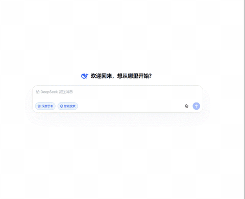
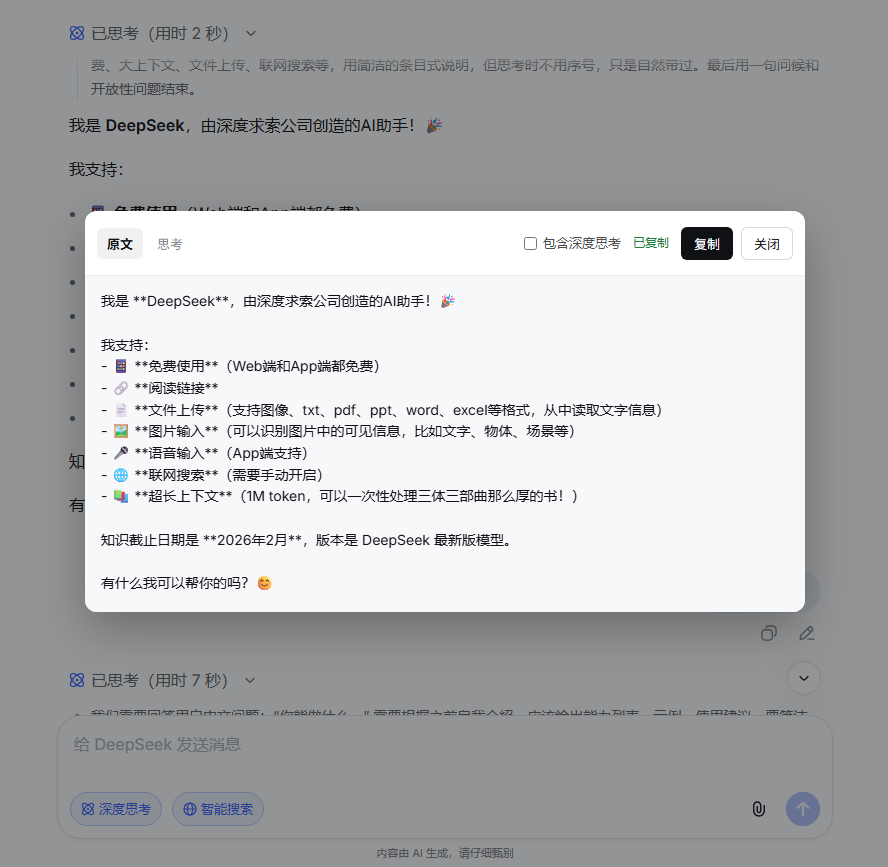

# DeepSeek Text Picker

[简体中文](README.md) | [繁體中文](README.zh-TW.md) | [English](README.en.md)


A Chrome / Edge extension (v0.2.0) for [chat.deepseek.com](https://chat.deepseek.com): shows a “Show source” icon next to replies with Markdown matching DeepSeek’s official Copy, and can export the full conversation.

## Usage





At the bottom of a DeepSeek reply:

1. Click **Show source** to view the Markdown source
2. Click **Export chat** to export the conversation as Markdown

**Copy** writes to the clipboard; on success the top bar shows **Copied**. When deep thinking is available, switch between **Source / Thinking**, and optionally **Include thinking**. Export supports copy or download as `.md`.

The UI language follows the browser UI language (built-in Simplified Chinese / Traditional Chinese / English; other languages fall back to Simplified Chinese).

If source / chat cannot be read: make sure the reply is fully loaded, or refresh and try again.

## Install

### From a Release (recommended)

1. Open [Releases](https://github.com/zhengqingquan/deepseek-text-picker/releases) and download `deepseek-text-picker-x.y.z.zip`
2. Extract it anywhere
3. Open Chrome / Edge and go to `chrome://extensions` (or `edge://extensions`)
4. Enable **Developer mode** → **Load unpacked** → select the extracted folder (it must contain `manifest.json`)
5. Open or refresh the DeepSeek chat page

### From the source tree

1. Open the Chrome / Edge extensions page and enable Developer mode
2. **Load unpacked** and select this repo’s `extension` directory
3. Open or refresh the DeepSeek chat page

After code changes: click **Reload** on the extensions page, then refresh the chat page. To pack locally:

```powershell
.\scripts\pack-extension.ps1
```

Output: `dist/deepseek-text-picker-<version>.zip`.

## How it works

On click, the extension reads the chat store from **in-page memory** (zustand `D.L` → `getMessage` / `sessionStore`), aligning body handling with official Copy; if needed it falls back to React fiber. **It does not intercept network requests.**

## Layout

```
docs/
  demo.gif        # README usage demo (GIF)
  screenshot.png  # README screenshot: Show source dialog
extension/
  _locales/       # chrome.i18n: zh_CN (default) / zh_TW / zh_HK / en
  manifest.json
  inject.js       # MAIN world: read in-page store
  content.js      # Isolated world: buttons, dialogs, talk to inject
  content.css
  popup.html      # toolbar popup
  popup.css
  popup.js
  icons/          # extension icons
scripts/
  pack-extension.ps1  # pack Release zip
```
